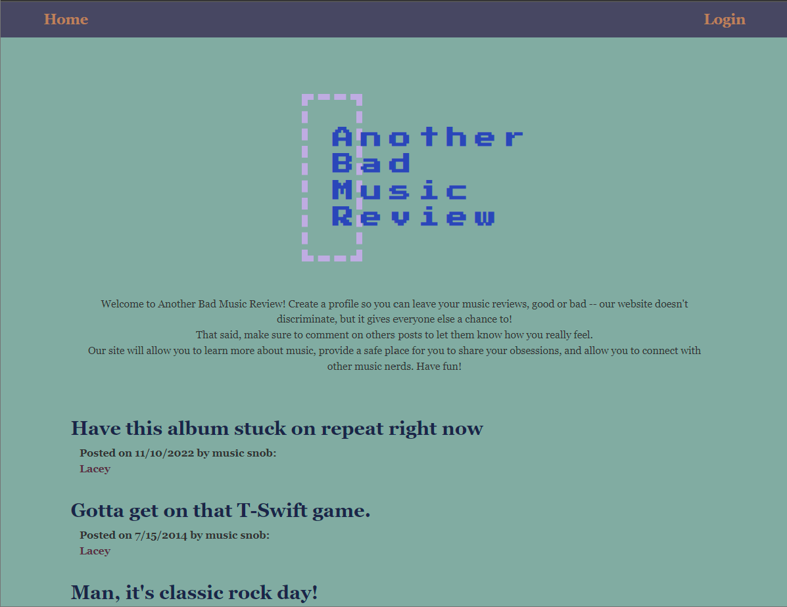

# Another Bad Music Review

## Description

Another Bad Music Review is a user-friendly web application designed to provide a platform for music lovers to share their (bad) opinions on specific songs from specific albums by specific artists. The application allows users to create profiles & create posts about their favorite songs, expressing their thoughts, opinions, & critiques about the music. Other users can read the posts, leave comments, & share their own opinions, making the application an engaging & interactive community for music lovers.

## Table of Contents

- [Installation](#installation)
- [Usage](#usage)
- [Deployment](#deployment)
- [Technologies](#technologies)
- [License](#license)
- [Developers](#developers)

## Installation

1. Download or clone repository
2. Node.js is required to run the application
3. `npm install` to install the required npm packages
4. Application will be invoked by using the following command: `node server.js`
5. Open your browser and go to `http://localhost:3001`

## Usage
* Creating Posts
  * You must be logged in to create a post
  * Once you are logged in, navigate to your Profile from the navigation bar where you can put in the track title, album, and artist and your post description where you can write your opinion on the song, express your thoughts on its lyrics, melody, rhythm, or any other aspect that stands out to you.
  * Please note that your log-in session will be logged out after 10 minutes of no activity.

* Commenting on Posts
  * We encourage users to engage with each other by leaving comments on posts! 
  * To comment on a post, simply click on a post your'd like to comment on and use the comment text box to share your thoughts and opinions, discuss the music with other users, and learn from different perspectives. Once you've got your comment written, press post comment.

## Deployment
Live URL: <a href="https://another-bad-music-review-woo.herokuapp.com/">Another Bad Music Review</a>  

## Technologies
* JavaScript
* MySQL
* Node.js
* Express.js
* Handlebars
* Sequelize

## License
This project is licensed under the MIT license. For more information about this license and what it entails, visit the MIT website <a href="https://opensource.org/licenses/MIT">here</a>.

## Developers

<li><strong><a href="https://github.com/alimomin7861" target="__blank">Ali Momin</a>:</strong> Back-End Engineer; JavaScript, API</li>

<li><strong><a href="https://github.com/olivianit" target="__blank">Olivia Nitzel</a>:</strong> Front-End Engineer</li>

<li><strong><a href="https://github.com/esanchez8k" target="__blank">Enrique Sanchez</a>:</strong> Front-End Engineer; Wireframe </li>

<li><strong><a href="https://github.com/imanmogh" target="__blank">Iman Moghaddas</a>:</strong> Back-End Engineer; Front-End Engineer </li>

<li><strong><a href="https://github.com/eddieg00 " target="__blank">Edward Gutierrez</a>:</strong> Back-End Engineer; Presentation, Front-End Engineer</li>

<li><strong><a href="https://github.com/blairrrrwho" target="__blank">Blair Millet</a>:</strong> Full-Stack; Git Flow</li>

- - -  
© 2023 Another Bad Music Review, Inc. All Rights Reserved.
